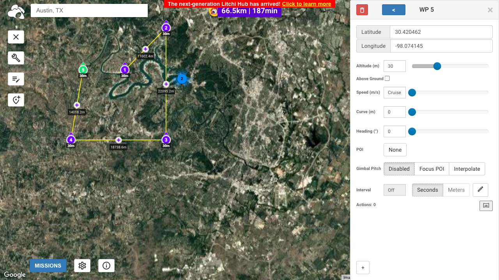

# flight-planner-playwright-tests

**Flight Planner Playwright Tests** is a lean suite of Playwright tests designed to validate the core flows of the browser-based flight planning app, [Litchi Hub](https://flylitchi.com/hub). The suite is structured with tests in the `tests/` folder and page objects in the `pages/` folder, featuring examples for verifying the display of the logo, adding waypoints, and simulating randomized flight-path scenarios. All tests are orchestrated through a single `playwright.config.ts` file and can be run using standard Playwright CLI commands.

Below is a preview of test output for `tests/random-flight-path.spec.ts`:



## File Structure

```
playwright-tests/
├── pages/
│   └── litchiHub.page.ts
│
├── tests/
│   ├── add-multiple-waypoints.spec.ts
│   ├── add-waypoint.spec.ts
│   ├── atx-search.spec.ts
│   ├── has-logo.spec.ts
│   └── random-flight-path.spec.ts
│
├── .gitignore
├── package-lock.json
├── package.json
├── playwright.config.ts
└── README.md
```

## Running Playwright

```bash
# Run all tests
npx playwright test

# Run a specific test
npx playwright test add-waypoint.spec.ts

# Run a test by title
npx playwright test -g "should set waypoint and validate latitude input"

# Run tests in headed mode
npx playwright test --headed

# Run tests in debug mode
npx playwright test --debug

# Run tests in UI mode
npx playwright test --ui

# Run tests for specific browser
npx playwright test --project=chromium
```

## Installing Playwright

```bash
npm init playwright@latest
npx playwright test
npx playwright show-report
```

## Updating Playwright

```bash
npm install -D @playwright/test@latest
npx playwright install --with-deps
npx playwright --version
```
